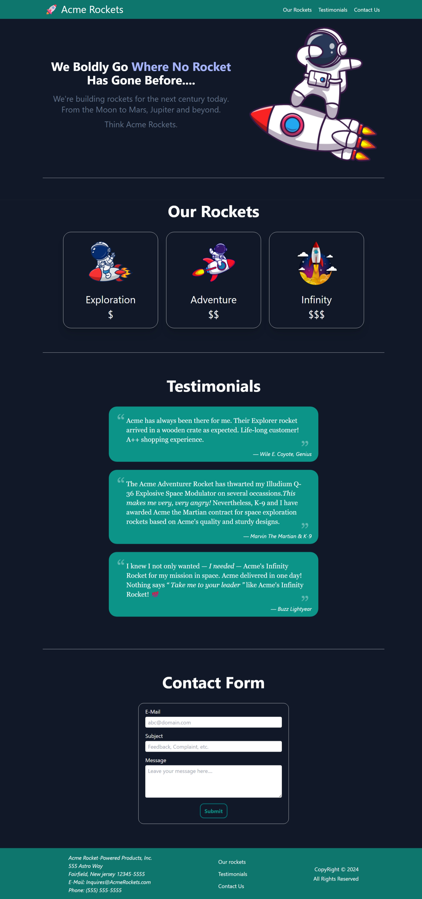

# Acme Rockets 🚀

Welcome to **Acme Rockets**!  
This is a simple, responsive, single-page website built to help me learn and practice [Tailwind CSS](https://tailwindcss.com/).

## ✨ Features

- **Responsive Design:** Looks great on all devices.
- **Modern UI:** Built entirely with Tailwind CSS utility classes.
- **Sticky Header & Mobile Menu:** Navigation adapts for mobile with a hamburger menu.
- **Sections:**
  - Hero section
  - Rockets showcase
  - Testimonials
  - Contact form
  - Footer with address and quick links
- **Dark Mode Ready:** Uses Tailwind’s dark mode utilities.

## 🚀 Why This Project?

I created this project as a hands-on way to learn and experiment with Tailwind CSS.  
It covers:
- Layouts with Flexbox and Grid
- Responsive breakpoints
- Custom utility classes and animations
- Styling forms and interactive elements
- Using Tailwind’s dark mode

## 🛠️ How to Run

1. **Clone or Download** this repository.
2. Open `index.html` in your browser.
3. All styles are loaded via CDN (no build step required).

## 📁 Project Structure

```plaintext
acme_rockets/ 
├── index.html
├── tailwind_1.js
├── space_img/
│   ├── favicon.ico
│   ├── rocketdab.png
│   ├── rocketman.png
│   ├── rocketride.png
│   └── rocketlaunch.png
```

## 🧑‍💻 What I Learned

- How to use Tailwind utility classes for rapid styling
- Creating custom animations with Tailwind and CSS
- Responsive design techniques with Tailwind breakpoints
- Building accessible and mobile-friendly navigation

## 📸 Preview



## 📚 Resources

- [Tailwind CSS Documentation](https://tailwindcss.com/docs)
- [Heroicons](https://heroicons.com/) (for icons, if used)

---

> **Note:** This project is for learning purposes only and does not include backend functionality.
> Feel free to fork and modify it as you like!


## 🙏 Acknowledgements

> I watched the [Tailwind CSS Full Course](https://youtu.be/lCxcTsOHrjo?si=wH_djS-S2hHujjgc) on YouTube to help build this project.

---

Happy coding! 🚀

